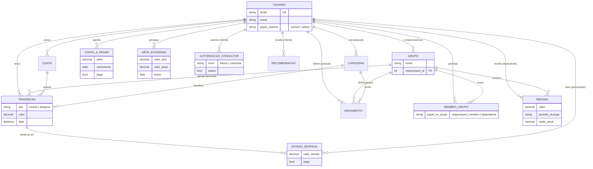

# Arquitetura — NossoBolso (Finanças Compartilhadas)

## Diagrama ER



## Estrutura de pastas

```
/
├── docker-compose.yml
├── .env / .env.example
├── README.md
├── DEEPSEEK.md
├── DEVLOG.md
├── docs/
│   ├── plano.md
│   ├── arquitetura.md
│   └── checklist.md
├── backend/
│   ├── Dockerfile
│   ├── requirements.txt
│   ├── manage.py
│   └── core/
│       ├── settings.py
│       ├── urls.py
│       ├── wsgi.py
│       ├── models.py
│       ├── serializers.py
│       ├── views.py
│       ├── permissions.py
│       ├── admin.py
│       ├── tests/
│       │   ├── test_auth.py
│       │   ├── test_permissions.py
│       │   ├── test_crud.py
│       │   ├── test_integrity.py
│       │   └── test_business.py
│       └── management/commands/
│           └── seed_demo.py
└── frontend/
    ├── Dockerfile
    ├── package.json
    ├── vite.config.js
    └── src/
        ├── App.jsx
        ├── api/
        ├── pages/
        ├── components/
        └── contexts/
```

## Entidades do modelo de dados

### MVP

```
Usuario (AbstractUser customizado)
  ├── email (USERNAME_FIELD, unique)
  ├── nome
  ├── papel_sistema: "comum" | "admin"
  └── data_criacao

Conta
  ├── usuario (FK → Usuario)
  ├── nome
  ├── saldo_inicial (Decimal)
  └── ativa (boolean)

Categoria
  ├── usuario (FK → Usuario, nullable — se null = categoria padrão/sistema)
  ├── nome
  ├── tipo: "receita" | "despesa"
  └── padrao (boolean)

Transacao
  ├── usuario (FK → Usuario)
  ├── conta (FK → Conta)
  ├── categoria (FK → Categoria)
  ├── tipo: "receita" | "despesa"
  ├── valor (Decimal)
  ├── descricao
  ├── data
  ├── grupo (FK → Grupo, nullable — se pertencer a um grupo)
  └── fixa (boolean)

Grupo
  ├── nome
  ├── descricao
  ├── responsavel (FK → Usuario)
  ├── data_criacao
  └── ativo (boolean)

MembroGrupo
  ├── grupo (FK → Grupo)
  ├── usuario (FK → Usuario)
  ├── papel_no_grupo: "responsavel" | "membro" | "dependente"
  └── data_entrada

Orcamento
  ├── usuario (FK → Usuario, nullable — orçamento pessoal)
  ├── grupo (FK → Grupo, nullable — orçamento do grupo)
  ├── categoria (FK → Categoria)
  ├── valor_limite (Decimal)
  └── periodo (Date)

DivisaoDespesa
  ├── transacao (FK → Transacao)
  ├── participante (FK → Usuario)
  ├── valor_devido (Decimal)
  └── pago (boolean)
```

### Evolução (implementados após o MVP — todos com endpoints)

```
Mesada
  ├── dependente (FK → Usuario)
  ├── grupo (FK → Grupo)
  ├── valor (Decimal)
  ├── periodo_recarga: "semanal" | "quinzenal" | "mensal"
  └── saldo_atual (Decimal)

AutorizacaoConsultor
  ├── consultor (FK → Usuario)
  ├── cliente (FK → Usuario)
  ├── nivel: "leitura" | "comentar"
  └── status (boolean — ativa/inativa)

ContaAPagar
  ├── usuario (FK → Usuario)
  ├── descricao
  ├── valor (Decimal)
  ├── vencimento (Date)
  ├── recorrencia (boolean)
  └── pago (boolean)

Recomendacao
  ├── consultor (FK → Usuario)
  ├── cliente (FK → Usuario)
  ├── texto
  └── data

MetaEconomia
  ├── usuario (FK → Usuario)
  ├── nome
  ├── valor_alvo (Decimal)
  ├── valor_atual (Decimal)
  ├── prazo (Date, opcional)
  └── criada_em
```

## Regras de acesso por visão

### Membro (papel_sistema = "comum")

| Recurso | Permissão |
|---|---|
| Conta, Categoria, Transacao próprias | CRUD completo |
| Orçamento pessoal | CRUD completo |
| Grupos de que é membro | Leitura |
| Transações do grupo | Leitura |
| Orçamento do grupo | Leitura |
| Administrar grupo (membros, metas) | **Negado** |
| Finanças de outros usuários | **Negado** |

### Gestor / Responsável (MembroGrupo.papel_no_grupo = "responsavel")

Tudo do Membro, mais:

| Recurso | Permissão |
|---|---|
| Grupo (membros, orçamento, metas) | CRUD completo |
| Despesas do grupo com divisão | Criação |
| "Quem deve a quem" | Leitura |
| Finanças pessoais não compartilhadas de membros | **Negado** |

### Administrador (papel_sistema = "admin")

| Recurso | Permissão |
|---|---|
| Usuários | CRUD via Django Admin + API |
| Categorias padrão | CRUD |
| Django Admin | Acesso completo |
| Transações, contas, orçamentos de usuários | **Negado** |

### Regras gerais

- Toda requisição a recurso protegido exige token; 401 se ausente
- Cada usuário só acessa as próprias transações, contas e categorias pessoais
- Consultor só acessa clientes autorizados, em modo leitura (evolução)
- Dependente só acessa a própria mesada e lançamentos (evolução)

## Invariantes de negócio

1. **Soma das partes = valor total:** Em toda DivisaoDespesa, Σ(valor_devido de todos os participantes) deve ser exatamente igual ao `valor` da Transação
2. **Integridade referencial:** Toda Transação aponta para Conta e Categoria válidas e pertencentes ao mesmo usuário
3. **Mesada:** Gasto acima do limite do período é bloqueado (evolução)

## Decisões para o MVP (e resolução na fase de evolução)

| Ponto em aberto (plano §7) | Decisão adotada |
|---|---|
| Divisão de despesa | Valores definidos por lançamento, com opção de dividir em partes iguais |
| Mesada (automática vs manual) | **As duas**: recarga automática por período (campo `ultima_recarga` + crédito preguiçoso ao consultar a mesada ou lançar gasto, e comando `recarregar_mesadas` para agendamento) e recarga manual pelo gestor (`POST /api/mesadas/{id}/recarregar/`) |
| Consultor (leitura ou sugestões) | Dois níveis: `leitura` (só visualiza) e `comentar` (visualiza + cria recomendações) |
| Gráficos | Somente o essencial: pizza por categoria + barra previsto × realizado (Recharts) |
| Cliente real para validação | Sessão de validação simulada com roteiro de família/república — ver `docs/validacao.md` |

## Extras implementados na evolução

| Recurso | Backend | Frontend |
|---|---|---|
| Contas a pagar | `/api/contas-a-pagar/` (CRUD + filtro `?pago=`) | Aba "A Pagar" no painel Membro |
| Metas de economia | `/api/metas/` (CRUD + `POST {id}/aportar/`) | Aba "Metas" com barra de progresso |
| Importação de extrato CSV | `POST /api/transacoes/importar_csv/` | Botão "Importar CSV" na aba Transações |
| Lembretes por e-mail | `python manage.py enviar_lembretes` (vencimentos + orçamentos estourados) | — |
| Recarga de mesada | `POST /api/mesadas/{id}/recarregar/` (só gestor) | Aba "Mesadas" no painel Gestor |
| Autorizar consultor | `POST /api/autorizacoes/` aceita `consultor_email`; `cliente` é sempre o usuário logado | Aba "Consultores" no painel Membro (autorizar, revogar, reativar, ver recomendações) |
| Filtros de transações | `?data_inicio=&data_fim=&categoria=&tipo=&grupo=` | — |

## Produção

- Backend servido por **gunicorn** (3 workers) com estáticos via **whitenoise** (o Django Admin funciona sem servidor de arquivos separado)
- `migrate` + `collectstatic` automáticos no start do container
- `DEBUG`, `SECRET_KEY`, `ALLOWED_HOSTS`, `EMAIL_BACKEND` e `DEFAULT_FROM_EMAIL` lidos de variáveis de ambiente (`.env`)
